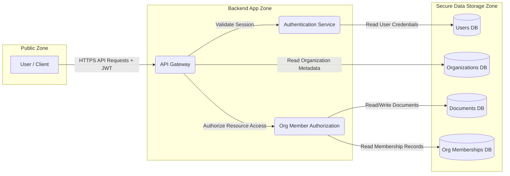

# Threat Model

## Assets

| Asset ID | Asset                    | Description                                           |
| -------- | ------------------------ | ----------------------------------------------------- |
| A1       | User Accounts            | User identities, credentials, and profile information |
| A2       | Organizations            | Organization metadata and configuration               |
| A3       | Documents                | User-created documents and content                    |
| A4       | Organization Memberships | User-to-organization relationships and roles          |
| A5       | Session Tokens           | JWT access tokens used for authentication             |

---

## Data Flow Diagram (DFD)

---

## Threats

| Threat ID | Threat Name                              | Data Flow            | Asset(s)   | STRIDE Category        | Mitigation Strategy                                                                                                     |
| --------- | ---------------------------------------- | -------------------- | ---------- | ---------------------- | ----------------------------------------------------------------------------------------------------------------------- |
| T1        | API Request Flooding                     | User → API           | A1-A5      | Denial of Service      | Implement rate limiting and request throttling.                                                                         |
| T2        | JWT Tampering                            | User → API           | A5         | Tampering              | Sign JWTs using strong asymmetric keys (RS256). Validate signatures, issuer, audience, and expiration on every request. |
| T3        | Authentication Activity Denial           | API → Auth           | A1         | Repudiation            | Implement audit logging for login attempts, authentication failures, and session validation events.                     |
| T4        | User Data Exposure                       | Auth → Users DB      | A1         | Information Disclosure | Encrypt sensitive data at rest. Limit query scope and avoid exposing internal details through error messages.           |
| T5        | Broken Object-Level Authorization (BOLA) | API → AuthZ          | A2, A3, A4 | Elevation of Privilege | Enforce organization-scoped authorization and object ownership checks for every resource access request.                |
| T6        | Token Theft / Re-use         | User → API           | A5         | Spoofing               | Enforce HTTPS, validate JWTs strictly, and use short-lived access tokens.                                               |
| T7        | Injection Attack (SQL/NoSQL)             | API → Database Flows | A1-A4      | Tampering              | Use parameterized queries, input validation, and ORM protections where applicable.                                      |
